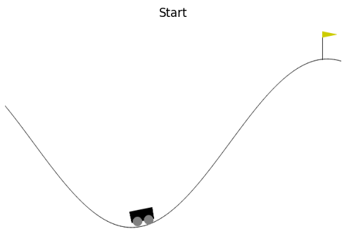

### Mountain Car: Handling Sparse Rewards

This project is a part of Artificial Neural Networks and Reinforcement Learning (CS-456) course at EPFL. The agents' definitions givin in the `agents.py` file and the training procedure with the results is given in `mountain_car.ipynb` notebook. The final report of the project can be found at `pdf/report.pdf`.

This project focuses on solving the *Mountain Car* problem in reinforcement learning (RL), a classic environment where a car must climb a hill, controlled by a sparse reward system. The challenge lies in the sparse reward structure where the agent only receives a reward upon success, leading to slow learning.

Here is the initial state of the problem:

#### Algorithms Explored
The report compares different RL methods to overcome the sparse reward issue, including:

1. **Basic DQN (Deep Q-Network):**
   - A model-free RL algorithm where the agent learns to map states to actions using a deep neural network. It uses experience replay to stabilize training.
   - Results: Basic DQN failed to solve the environment effectively due to the sparsity of the rewards, as seen in Figure 2.

2. **DQN with Heuristic Rewards:**
   - A custom reward function is added to incentivize the agent's performance based on position and velocity (Equation 3). This auxiliary reward speeds up learning by giving intermediate rewards.
   - Results: The agent performed significantly better, starting to learn around 600 episodes (Figure 3). However, the solution was tailored to this specific environment, limiting generalizability (Figure 4).

3. **DQN with Reward Network Distillation (RND):**
   - An intrinsic reward mechanism, independent of the environment's structure, that encourages exploration by comparing the outputs of a target and a predictor network.
   - Results: This approach led to faster learning, with the agent starting to learn around 500 episodes and eventually relying mostly on the environment rewards, as shown in Figure 5 and Figure 6.

4. **Deep Dyna-Q:**
   - This algorithm combines model-free and model-based RL, where the agent learns a model of the environment to simulate additional experiences, speeding up exploration and learning.
   - Results: The Dyna agent explored the environment more efficiently (Figure 10), and the learned Q-values indicated better exploration of the state space (Figure 11).

#### Final Comparison
All the tested algorithms successfully learned the task by the end of the training process, as shown in Figure 7. However, DQN struggled with sparse rewards, while heuristic and intrinsic rewards improved performance. The Dyna-Q algorithm demonstrated the most efficient learning by leveraging both real and simulated experiences.

*All the figure and equation numbers refer to the report*